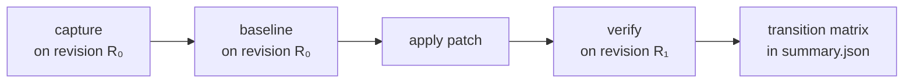

# Baseline & Verify

`snapshot-tool` has two related comparison subcommands that produce different outputs:

| Subcommand | What it writes | When to use |
|------------|----------------|-------------|
| `verify`   | `summary.json` with per-outcome counts (`passed`, `failed`, `skipped`). Exits non-zero on failure. | Day-to-day correctness gate. |
| `baseline` | `<snapshot_dir>/baseline.json` with a per-test pass/fail/skip map. Always exits 0. | Record the *starting* state so a later `verify` can compute a transition matrix. |

When a `baseline.json` is present in the snapshot directory, `verify` reads it and augments `summary.json` with a **3×3 transition matrix**.

## When to use which

The intuition: `verify` answers "did anything regress?", `baseline` answers "what was the state at this point in time?". For local development you usually only need `verify`. For grading an optimization PR — where you care about which tests changed status, not just the totals — you want `baseline` followed by `verify`.

The canonical CI flow:



## The 3×3 matrix

Both `baseline` and the per-test status pass produced by `verify` use the same vocabulary: `pass`, `fail`, `skip`. `compute_transitions(baseline, verify)` produces a count for every observed `<baseline>-to-<verify>` pair.

The cells, in `summary.json` ordering:

|              | → pass | → fail | → skip |
|--------------|--------|--------|--------|
| **from pass** | `pass-to-pass` | `pass-to-fail` | `pass-to-skip` |
| **from fail** | `fail-to-pass` | `fail-to-fail` | `fail-to-skip` |
| **from skip** | `skip-to-pass` | `skip-to-fail` | `skip-to-skip` |

Interpreting cells:

| Cell | What it usually means |
|------|----------------------|
| `pass-to-pass` | Stable correct test — your patch left this test intact. |
| `pass-to-fail` | **Regression** — a previously-passing test now produces a different output. |
| `pass-to-skip` | A previously-passing test crashed or got skipped on verify (e.g., raised an exception, returned an unpicklable). Worth investigating. |
| `fail-to-pass` | Your patch fixed a previously-failing test. This is the win condition for optimization PRs that include corrections. |
| `fail-to-fail` | Still failing in the same way (or differently — the matrix only counts statuses, not specific errors). |
| `fail-to-skip` | Previously failed; now skipped. Often noise — the snapshot may have been a failed-capture marker. |
| `skip-to-pass` | Previously skipped (no snapshot or failed capture); now produces a comparable output. |
| `skip-to-fail` | Skipped during baseline (likely no snapshot), but now the test produces an output that's different from the **original capture**. Diagnose by inspecting what's in `.snapshots/`. |
| `skip-to-skip` | Persistently un-snapshottable — e.g., a benchmark that returns a generator. |

Only `test_id`s present in **both** `baseline.json` and the verify pass are counted. Tests added or removed between the two runs are silently dropped.

## `test_id`

A `test_id` is a stable, on-disk-path-like string identifying one `(benchmark, parameters)` row:

```
<module_path>/[<class_name>.]<benchmark_name>/<param-hash>
```

The `param-hash` is a 16-character MD5 prefix of `repr(parameters)`. The same hashing function is used for storing snapshots, so a snapshot file and a baseline entry for the same test always agree on the path.

Two examples:

- A free function `time_compute()` in `benchmarks/foo.py` with no parameters:
  `foo/time_compute/99914b932bd37a50`
- A method `time_union(self, n, geom_type)` on class `TimeUnion` in `benchmarks/geometry/union.py`, parameters `(100, "polygon")`:
  `geometry.union/TimeUnion.time_union/<md5 of '(100, "polygon")'>`

You don't normally construct these by hand — `SnapshotManager.get_test_id(...)` does it consistently.

## What `baseline.json` looks like

```json
{
  "schema": "snapshot_tool/baseline@2",
  "timestamp": "2026-05-14T10:11:00.123456",
  "entries": {
    "geometry.union/TimeUnion.time_union/2f3a...": "pass",
    "geometry.union/TimeUnion.time_union/8c1e...": "fail",
    "coordinates/time_separation/99914b932bd37a50": "skip"
  },
  "meta": {
    "counts": {"total": 124, "pass": 118, "fail": 2, "skip": 4},
    "snapshot_dir": ".snapshots",
    "benchmark_dir": "benchmarks"
  }
}
```

The schema tag (`snapshot_tool/baseline@2`) reserves room for future formats. The current reader accepts any payload with an `entries` dict; the `meta` block is informational.

## Status normalization

`compute_transitions` runs every status through `_normalize_status` before matching:

- The legacy status `"failed_to_pass"` is mapped to `"fail"`. Older baseline files used this name; newer ones use `"fail"` directly.
- Anything else passes through unchanged. In practice, the only values in the wild are `pass`, `fail`, and `skip`.

## Wiring into CI

A minimal optimization-grading workflow:

```yaml
# Pseudocode for a CI job
- name: Capture and baseline on main
  run: |
    git checkout main
    snapshot-tool capture  benchmarks --snapshot-dir .snapshots
    snapshot-tool baseline benchmarks --snapshot-dir .snapshots

- name: Verify on the PR branch
  run: |
    git checkout ${{ github.head_ref }}
    snapshot-tool verify   benchmarks --snapshot-dir .snapshots --summary summary.json

- name: Surface transition counts
  run: |
    jq '. | {passed, failed, "pass-to-fail", "fail-to-pass"}' summary.json
```

The `verify` step will exit non-zero if any test failed. If you only want to grade transitions without failing the build on `pass-to-fail`, run `verify` with `|| true` and inspect `summary.json` yourself.

## Common pitfalls

- **`baseline` before `capture`.** `baseline` reads existing snapshots; it doesn't create them. If you call `baseline` before `capture`, every entry will be `skip` (no snapshot) and the resulting transition matrix will be useless.
- **Different `--snapshot-dir` between `baseline` and `verify`.** Both must point at the same directory — `baseline.json` lives inside it.
- **Different `--filter` between `baseline` and `verify`.** The matrix only counts overlapping `test_id`s. Filtering differently shrinks the overlap silently.
- **Non-deterministic benchmarks.** If a benchmark returns a value that depends on randomness, on iteration order of a `set`, or on the wall clock, it will appear as `pass-to-fail` even when nothing meaningful changed. See [Determinism](determinism.md) for the RNG controls that mitigate this. Wall-clock and dict/set-order issues need fixing in the benchmark itself.

## Next steps

- [CLI](cli.md) — Per-subcommand reference.
- [Snapshot Storage](storage.md) — Where `baseline.json` lives and how `test_id`s are constructed.
- [Determinism](determinism.md) — Why RNG patching is non-optional for stable transitions.
