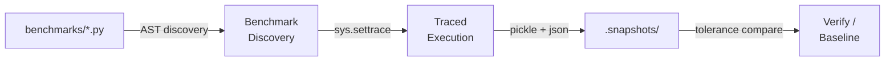

# snapshot-tool

<p align="center">
  <a href="https://formula-code.github.io/">
    
  </a>
  <a href="https://github.com/formula-code/snapshot-tester">
    
  </a>
  <a href="https://github.com/airspeed-velocity/asv">
    
  </a>
</p>

`snapshot-tool` is a snapshot-testing harness for [ASV](https://github.com/airspeed-velocity/asv) (airspeed-velocity) benchmarks. It captures the return value of each benchmark on a known-good revision, then re-runs the same benchmarks after a code change and reports which outputs drifted — with tolerance-aware numerical comparison.

It is the correctness companion to ASV's performance numbers: ASV tells you *how fast* a change is, `snapshot-tool` tells you *whether the result is still correct*.

## How it works



The pipeline runs in four phases:

1. **Discover** — AST-parse each `*.py` under `benchmark_dir` to find ASV-prefixed functions and methods (`time_`, `timeraw_`, `mem_`, `peakmem_`, `track_`). No imports happen at discovery time.
2. **Run** — Execute each benchmark with `sys.settrace` installed, RNGs reseeded, and a per-benchmark timeout. The tracer captures the shallowest meaningful return value from user code (stdlib, numpy internals, and shapely internals are filtered out).
3. **Persist** — Write a row into a single SQLite database at `.snapshots/snapshots.db`. Payloads are pickled, gzipped, and content-addressed by sha256 so benchmarks producing identical outputs share one blob on disk. A JSON metadata sidecar is also written per `(module, class, benchmark, parameters)` tuple for downstream tooling.
4. **Compare** — On a later run, replay each benchmark and compare to the stored snapshot using a pure-Python `isclose` (`rtol` / `atol` / `equal_nan`).

## Get started

The full roundtrip is four commands:

```bash
# 1. See what's discoverable
snapshot-tool list path/to/benchmarks

# 2. Capture a baseline snapshot of every benchmark's output
snapshot-tool capture path/to/benchmarks

# 3. (Optional) Record the current pass/fail state as a baseline for transition tracking
snapshot-tool baseline path/to/benchmarks

# 4. After a code change, verify nothing regressed
snapshot-tool verify path/to/benchmarks --tolerance 1e-5 1e-8
```

See the **[CLI guide](guide/cli.md)** for the full subcommand reference.

## Key features

- **Zero-instrumentation capture** — Benchmarks don't need to return anything explicitly. `sys.settrace` snaps the shallowest meaningful user-code return value, so existing ASV benchmarks that just compute-and-discard work as-is.
- **Tolerance-aware comparison** — Pure-Python `isclose` (`rtol` / `atol` / `equal_nan`) for scalars, numpy arrays (element-wise), Python sequences, dicts, and custom classes with `__eq__`. Numpy is optional — detected lazily.
- **Deterministic by construction** — Python `random`, numpy legacy and Generator APIs, PyTorch, and TensorFlow are reseeded before every run via [`RNGPatcher`](guide/determinism.md). The whole point of snapshot testing is bit-stable output.
- **Per-benchmark timeouts** — Each benchmark runs inside a `ThreadPoolExecutor.submit(...).result(timeout=...)` so hung benchmarks fail fast instead of stalling the whole run.
- **One SQLite file, deduplicated and gzipped** — Every payload is pickled, gzipped, and content-addressed by sha256 in a single `snapshots.db`. Benchmarks emitting identical outputs share a single blob via refcount. No tens-of-thousands of `.pkl` files.
- **Baseline → verify transition matrix** — Record a `baseline.json` of pass/fail/skip statuses on one revision, then `verify` against another to get a 3×3 transition matrix (`pass-to-fail`, `fail-to-pass`, etc.) — useful for grading optimization attempts in CI.
- **Python 3.8 → 3.13** — Pure standard library at runtime; numpy is detected lazily and never imported by the tool itself.

## Quick links

- [Installation](getting-started/installation.md) — Set up the dev environment with `uv`.
- [**CLI (`snapshot-tool`)**](guide/cli.md) — **The primary entrypoint** — full subcommand reference.
- [Python API Quickstart](getting-started/quickstart.md) — Programmatic usage of `BenchmarkDiscovery`, `BenchmarkRunner`, `SnapshotManager`, and `Comparator`.
- [Baseline & Verify](guide/baseline-and-verify.md) — The 3×3 transition matrix and how to wire it into CI.
- [Configuration](guide/configuration.md) — `snapshot_config.json` and CLI flag reference.
